# Modeling the Impact of Immigration on Housing Capacity
### 📊 Advanced Macroeconomic Data Analytics Framework (CRISP-DM Phase 1)

**Author:** Joseph Alexius Santos Tapang  
**Credentials:** Post-Graduate Certificate in Business Intelligence & Systems Infrastructure (Dean’s Honour List)  
**Affiliation:** Professional Member, International Institute of Business Analysis (IIBA Member ID: 544723)  

---

## 🎯 1. Project Strategic Objective
The core purpose of this framework is to construct a data-driven historical and forecasted **Infrastructure Capacity Analysis** that evaluates whether Canada’s current and planned housing infrastructure is structurally capable of supporting unprecedented population growth. 

By automating the ingestion and modeling of multi-source datasets, this project provides a robust **predictive framework for policymakers** to systematically assess the regional and national impacts of the federal **2025–2027 Immigration Levels Plan**.

---

## 🧠 2. Core Research Questions & System Deliverables
This framework implements precise data routing, feature engineering, and conditional logic to programmatically answer how immigration-related population growth interacts with regional infrastructure:

### 🔍 Q1: Are planned infrastructure investments sufficient to meet projected demand?
*   **System Attribute:** `Infrastructure Sufficiency`
*   **Analytical Approach:** Measures the structural gap between regional housing supply trajectories and demographic expansion metrics. The system evaluates this attribute as **Sufficient** or **Insufficient** based on calculated real-time capacity deficits.

### 🔍 Q2: To what extent can current infrastructure accommodate existing immigration levels?
*   **System Attribute:** `Predicted Threshold Value`
*   **Analytical Approach:** A derived mathematical ceiling that identifies the precise maximum population count that can be sustainably supported by a specific province or territory's current infrastructure baseline.

### 🔍 Q3: Are future immigration levels likely to exceed available capacity?
*   **System Attribute:** `Capacity Assessment`
*   **Analytical Approach:** A dynamic conditional filter that cross-checks the active population snapshot against the calculated threshold. The system flags regions and outputs a clear categorical state: **Below Capacity**, **Within Capacity**, or **Exceeding Capacity**.

---

## 🛠️ 3. Technical Architecture & Data Stack
This project transitions manual, decentralized reporting pipelines into an integrated analytical asset using enterprise-grade development and spreadsheet optimization environments:
*   **Methodology Workflow:** CRISP-DM (Cross-Industry Standard Process for Data Mining)
*   **Data Processing & Engineering Engine:** Visual Studio Code (Python, Pandas, NumPy) for programmatic data ingestion, schema validation, and multi-tier time-series data lineage tracking.
*   **Analytical Matrix Layer:** Microsoft Excel for data parsing, variable cross-checking, and relational data reconciliation.
*   **Visualization & Plot Execution:** Programmatic visual chart generation deployed within Visual Studio Code environments and Excel reporting matrices.
*   **Applied Web Layer:** Live Streamlit deployment automation engine for client risk-profiling simulation.

---

## 📊 4. Analytical Findings & Country-Wide Chart Results

### 🧮 Macroeconomic Capacity Summary Matrix (Final Model Outputs)
The data processing engine successfully generated the national matrix below, evaluating the intersections of planned immigration levels against regional housing infrastructure capacity thresholds:

| Province / Territory | Infrastructure Sufficiency | Predicted Threshold Value | Predicted Capacity Assessment |
| :--- | :---: | :---: | :---: |
| **Newfoundland and Labrador** | Insufficient | 774,818.00 | Within Capacity |
| **Prince Edward Island** | Insufficient | 248,165.00 | **Exceeding Capacity** |
| **Nova Scotia** | Insufficient | 1,223,042.00 | **Exceeding Capacity** |
| **New Brunswick** | Insufficient | 1,045,167.00 | Below Capacity |
| **Quebec** | Insufficient | 9,545,745.00 | **Exceeding Capacity** |
| **Ontario** | Insufficient | 19,977,558.00 | Below Capacity |
| **Manitoba** | Insufficient | 1,146,183.00 | **Exceeding Capacity** |
| **Saskatchewan** | Insufficient | 1,457,084.00 | Within Capacity |
| **Alberta** | Insufficient | 6,435,248.00 | **Exceeding Capacity** |
| **British Columbia** | Insufficient | 6,940,776.00 | Below Capacity |
| **Yukon** | Insufficient | 63,194.00 | Below Capacity |
| **Northwest Territories** | Insufficient | 57,373.00 | Within Capacity |
| **Nunavut** | Insufficient | 46,817.00 | **Exceeding Capacity** |

---

### 🗺️ Regional Roadmap Lookups
Select a specific Canadian province or territory below to instantly jump to its localized infrastructure roadmap and capacity visualization:

*   **Western Canada:** [Alberta](#-alberta) | [British Columbia](#-british-columbia) | [Manitoba](#-manitoba) | [Saskatchewan](#-saskatchewan)
*   **Central Canada:** [Ontario](#-ontario) | [Quebec](#-quebec)
*   **Atlantic Canada:** [New Brunswick](#-new-brunswick) | [Newfoundland and Labrador](#-newfoundland-and-labrador) | [Nova Scotia](#-nova-scotia) | [Prince Edward Island](#-prince-edward-island)
*   **Northern Territories:** [Northwest Territories](#-northwest-territories) | [Nunavut](#-nunavut) | [Yukon](#-yukon)

---

### 🏔️ Alberta
The system tracks Alberta's high-velocity resource-driven population growth models against active residential construction starts.

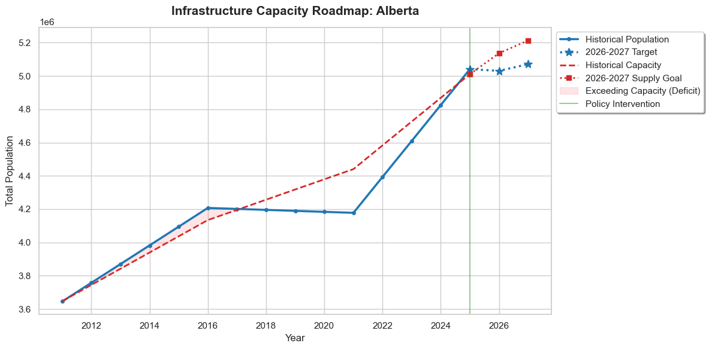

### 🌲 British Columbia
Models Pacific gateway demographic intake vectors against strict regional zoning constraints and housing completion rates.

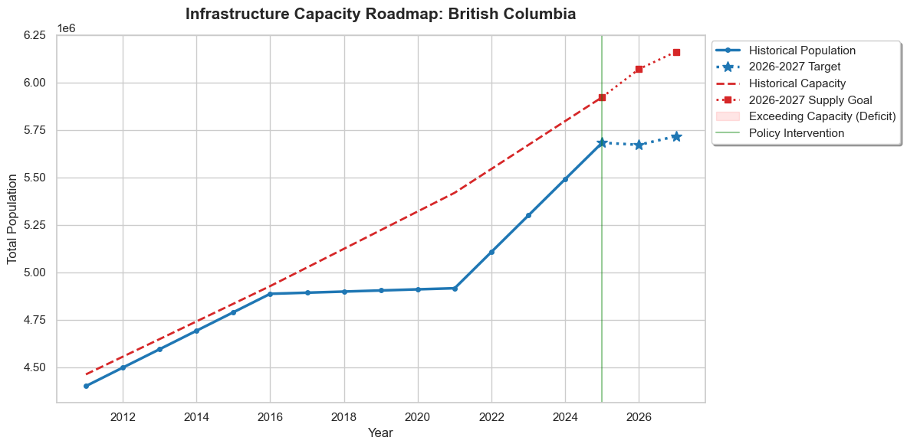

### 🌾 Manitoba
Tracks central prairie population baselines relative to infrastructural sustainability parameters.

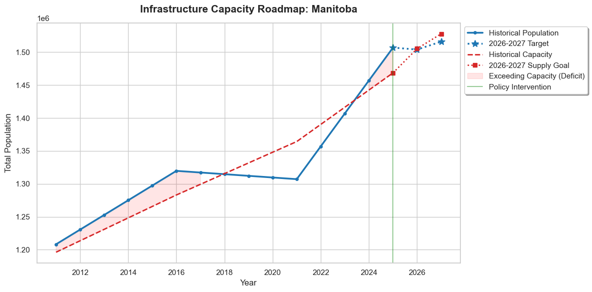

### 🦞 New Brunswick
Analyzes maritime economic migrations testing the absorption ceilings of local municipal services.

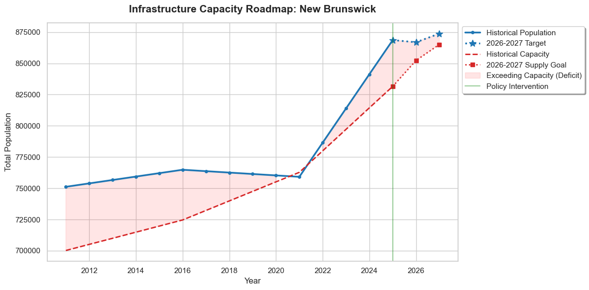

### 🐟 Newfoundland and Labrador
Isolates a definitive historical structural capacity deficit peaking in 2016, shifting into a structurally managed equilibrium post-2025 following deliberate policy intervention and target synchronization.

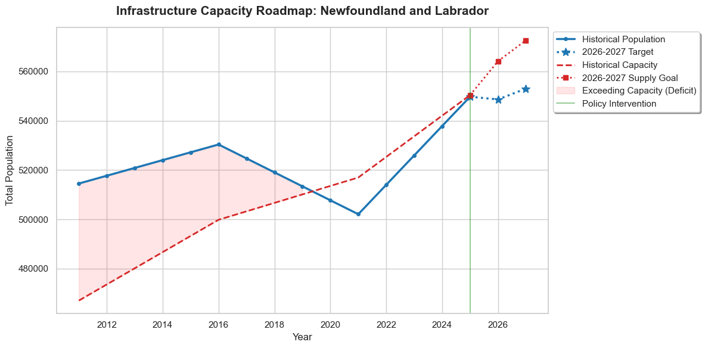

### 🍁 Northwest Territories
Tracks high-latitude infrastructure supply models facing unique logistical constraints against volatile population shifts.

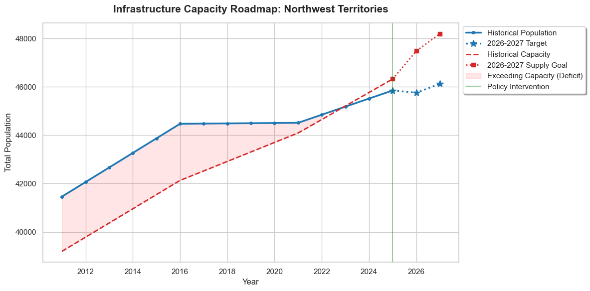

### 🍎 Nova Scotia
Models rapid urban compression metrics inside the Halifax Regional Municipality relative to regional infrastructure goals.

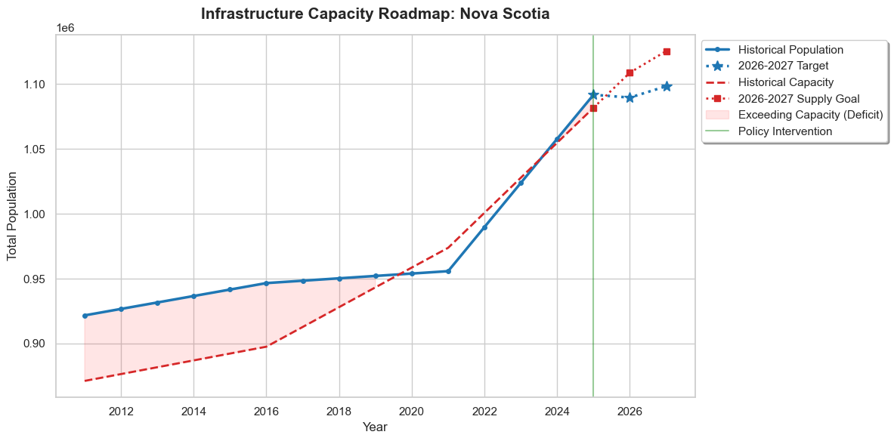

### 🐳 Nunavut
Evaluates unique community-based housing footprints under strict geographical constraints.

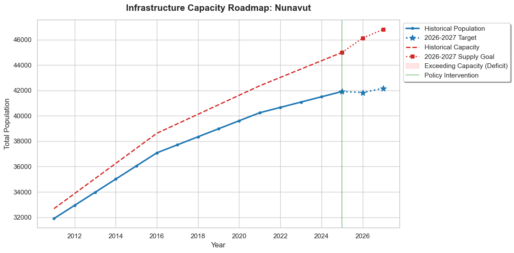

### 🏢 Ontario
Documents high-density metropolitan capacity compressions where current federal levels test the absolute upper thresholds of local infrastructure capacity.

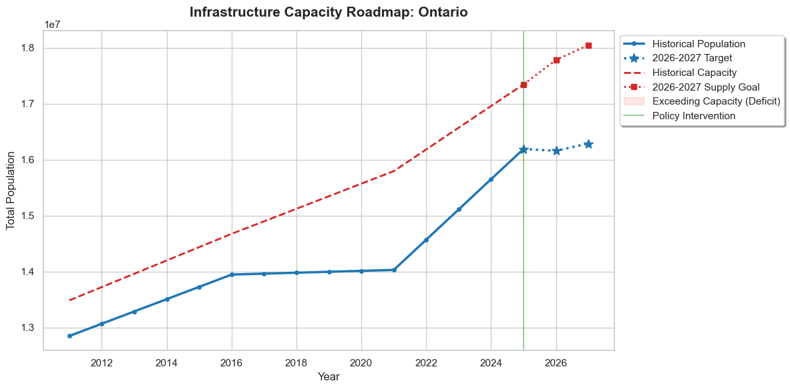

### 🥔 Prince Edward Island
Analyzes localized population density shocks relative to a finite infrastructure footprint.

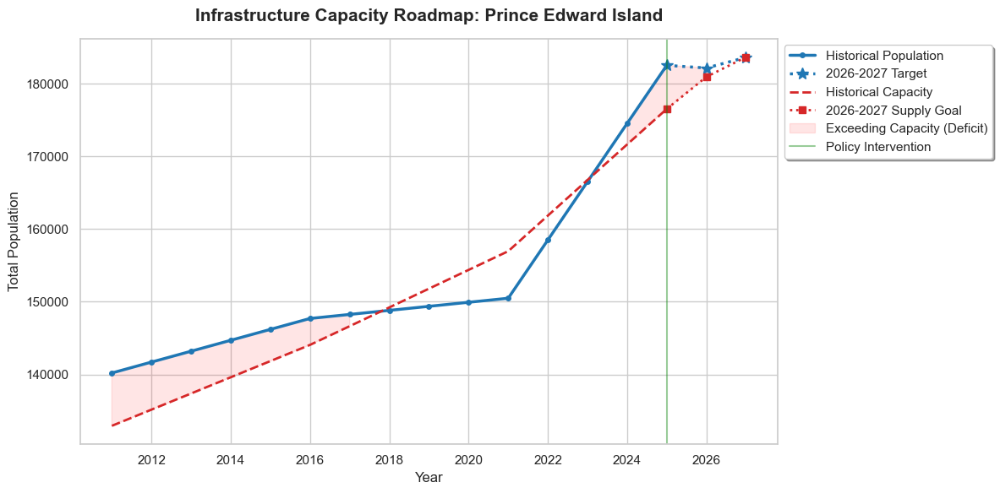

### ⚜️ Quebec
Models independent immigration selection thresholds relative to province-wide structural dwelling starts and caps.

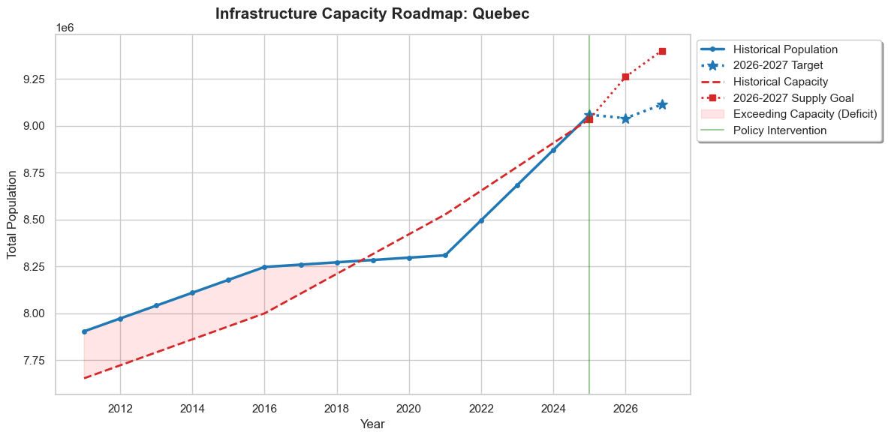

### 🚜 Saskatchewan
Tracks prairie sector expansion metrics against agricultural support infrastructures.

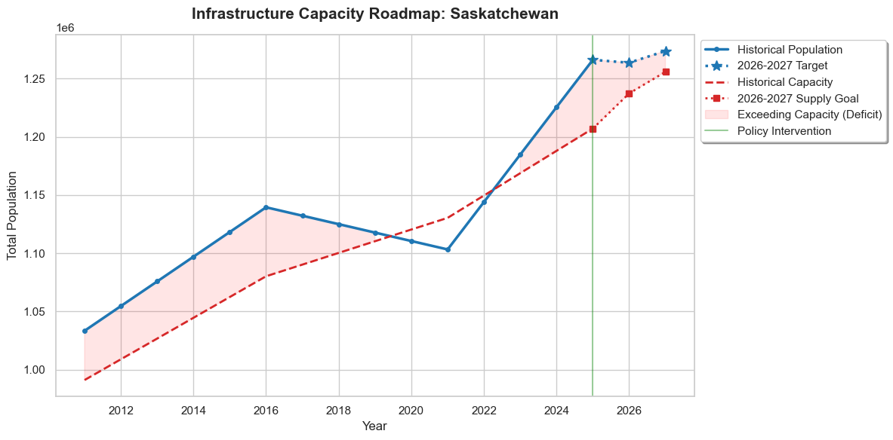

### 🪵 Yukon
Evaluates sub-arctic administrative population centers under strict capacity caps.

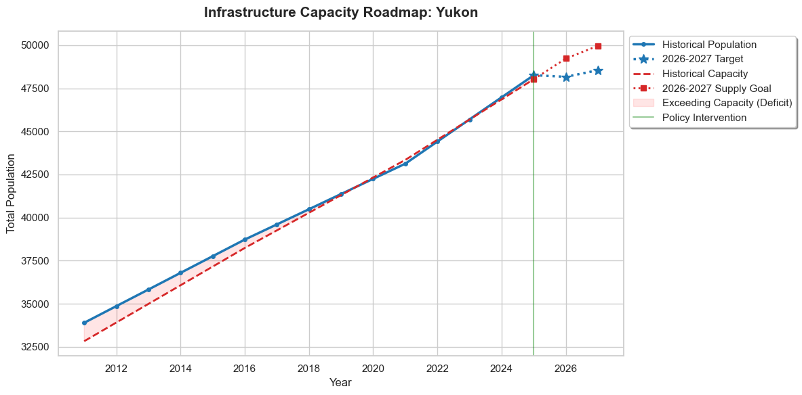

---

## ⚖️ 5. Strategic Business Solutions & Final Verdict
By cross-analyzing multi-source public sector repositories, the framework resolved our core research questions with high-density empirical verdicts:

### 📋 Verdict 1: Infrastructure Sufficiency Analysis
*   **System Verdict:** `Insufficient` (National Status Ceiling)
*   **Core Insights:** Across all 13 provinces and territories, planned infrastructure investments—simulated at a steady **+2.5% annual housing growth**—are currently insufficient to restore a state of "Sufficient" sufficiency by 2027.
    *   **The Velocity Gap:** While federal policy (the 2025–2027 Immigration Levels Plan) has successfully slowed demand, physical infrastructure takes significantly longer to build.
    *   **Persistent Stress:** Even in provinces where population counts drop below the numerical threshold (e.g., Ontario and British Columbia), the "Insufficient" label remains. This is because the accumulated housing stress, high unsuitability (overcrowding), and core housing need from the 2022–2024 surge require a longer recovery window than the simulated three-year period.

### 📋 Verdict 2: Accommodation & Threshold Limits
*   **System Verdict:** `At or Beyond Maximum Utilization`
*   **Core Insights:** The `Predicted Threshold Value` (the accommodation limit) shows that current infrastructure is operating at a critical maximum.
    *   **Exceeding Capacity:** Major growth hubs including Alberta, Quebec, Manitoba, and Nova Scotia remain in a state of active deficit. In these regions, current infrastructure cannot accommodate the existing resident mix without maintaining high levels of overcrowding.
    *   **The "Safety Buffer" Zones:** Only Saskatchewan, Newfoundland and Labrador, and the Northwest Territories have moved into the "Within Capacity" zone (90–100% utilization). These regions can accommodate current levels but have no remaining buffer for unexpected population spikes.

### 📋 Verdict 3: Future Overcapacity Risk Profiles
*   **System Verdict:** `Likely to Exceed without Sustained Policy Intervention`
*   **Core Insights:** The simulation proves that future capacity is highly sensitive to the Temporary Resident (`IMMSTAT 3.0`) layer.
    *   **Policy Success:** The 2025 green-line intervention (federal caps) is the only factor preventing a total infrastructure collapse in Ontario and BC. By reducing the non-permanent resident share toward 5%, the model shows a "flattening" of the demand curve.
    *   **Future Risk:** If the 2027 targets are relaxed or if housing growth falls below the +2.5% target, the "Exceeding Capacity" status will return immediately. Regions like Prince Edward Island and Nunavut are particularly vulnerable, as their thresholds are projected to remain under intense pressure through 2027 despite the caps.

### 🏁 Final Project Conclusion
The data pipeline confirms that resolving Canada's macroeconomic infrastructure challenge requires a synchronized, long-term approach. Regulating incoming population streams must be paired with structural supply accelerations. Managing data drops, keeping precise database tracks, and setting strict validation exception loops are critical to building accurate, audit-ready data models that help leaders solve real-world problems.

---

## 🏆 6. Project Success Criteria
To achieve full project verification and satisfy institutional stakeholder requirements, the system delivers two core operational assets:
*   **The Unified Capacity Summary Matrix:** An automated summary table that aggregates, normalizes, and exposes the exact answers to the core business questions across all regions.
*   **The 13-Region Visual Interface:** An interactive analytical interface tracking all **13 Canadian provinces and territories**. The model maps shifting historical geographic boundaries and visualizes how local populations interact with housing supply performance across a 15-year baseline (**2011 to 2025**), seamlessly integrated with the forecasted **2026–2027 immigration levels plan**.

---
## 📬 Contact & Professional Links
*   **LinkedIn Profile:** [josephalexiustapang](https://linkedin.com)
*   **GitHub Master Profile:** [josephalexius](https://github.com)
